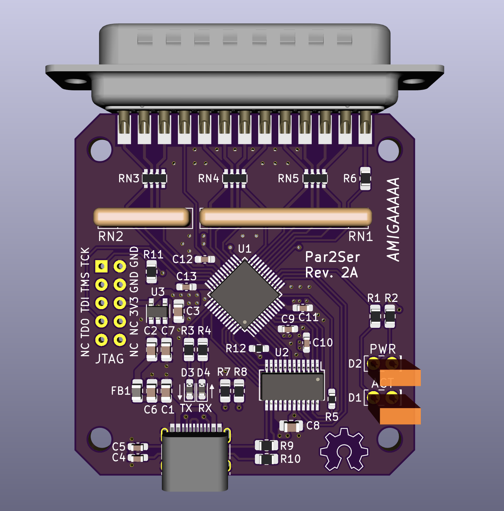

# Amiga Par2Ser device

> ⚠️ **Status: Pre-release / untested on real hardware.**
> This project is being made public as a work-in-progress. The Verilog and
> driver code have only been validated in simulation and WinUAE. **No Rev 2A
> board has been fabricated or tested yet.** Expect bugs, expect to need an
> oscilloscope, and **build at your own risk** — there are no tagged
> releases until the hardware is verified to work end-to-end. PRs and
> issues are welcome but be aware the design may still change in
> incompatible ways before the first release.

***
Rev. 2A <br />
<a href="images/Par2Ser_rev2A_pic1.png">

</a>

***

A `serial.device`-compatible Amiga driver that bridges the parallel port to a
USB FIFO (FT240X) via Niklas Ekström's 2E par-to-spi protocol, so unmodified
comms programs (c-kermit, NComm, …) can `set line par2ser.device`.

The hardware side is a small board built around a Lattice **LC4064V-75TN48C**
CPLD that speaks the 2E protocol to the Amiga and presents the bytes to an
**FT240X** USB FIFO. The PC sees a standard USB serial port (VCP).

## Repository layout

- **`amiga/`** — `par2ser.device` driver source (m68k, Bartman gcc).
- **`cpld/`** — Verilog firmware for the Lattice LC4064V CPLD.
  - `rtl/` — design sources (`par2ser_top.v`, `par2ser_fsm.v`).
  - `sim/` — Icarus Verilog smoke testbench.
  - `isplever/` — Lattice ispLEVER Classic 2.1 project files and pin
    constraints (`Par2Ser.lci`).
- **`KiCad/`** — KiCad 5.1 schematic and PCB sources (Rev 2A).
- **`images/`** — board photos and screenshots used in this README.
- **`Par2Ser_rev2a_schematic.pdf`** — exported schematic for quick
  reference without opening KiCad.

## Hardware overview (Rev 2A)

- **Lattice LC4064V-75TN48C** CPLD (48-pin TQFP, 64 macrocells, -75 speed)
- **FTDI FT240X** USB-to-parallel-FIFO (SSOP-24), USB-C connector
- **8-bit bidirectional buffer** between the Amiga DB-25 and the CPLD
- **JTAG header** for programming the CPLD via ispVM System with a
  cheap FT4232H-mini-module-based cable

The driver is built in the style of [SimpleDevice](https://github.com/jbilander/SimpleDevice)
for the Bartman `m68k-amiga-elf` (gcc 15.1) toolchain. The serial machinery
(receive ring buffer, `CMD_READ` satisfied from buffer, `SDCMD_QUERY` count
from a software counter) is ported from Iain Barclay's `8n1.device` 43.5.

## Bill of Materials (Rev 2A)

Sourcing notes: most actives and precision passives are from
[Mouser](https://www.mouser.com/), the connectors and decorative
LEDs are inexpensive enough to come from AliExpress sellers (linked
examples below — any equivalent footprint works). Generic 0805/0603
passives can be substituted with any reputable manufacturer's part
matching the value, package, and dielectric/tolerance noted.

| Ref               | Qty | Value / Part         | Description                                    | Package        | Source                                                                                          | Notes                                                       |
|-------------------|-----|----------------------|------------------------------------------------|----------------|-------------------------------------------------------------------------------------------------|-------------------------------------------------------------|
| **U1**            | 1   | LC4064V-75TN48C      | Lattice ispMACH 4000V CPLD                     | 48-TQFP        | [Mouser 842-LC4064V75TN48C](https://www.mouser.com/ProductDetail/842-LC4064V75TN48C)             | 64 macrocells, -75 speed grade                              |
| **U2**            | 1   | FT240XS-R            | FTDI USB-to-parallel FIFO                      | SSOP-24        | [Mouser 895-FT240XS-R](https://www.mouser.com/ProductDetail/895-FT240XS-R)                       | USB 2.0 Full Speed; VCP driver                              |
| **U3**            | 1   | TLV75533PDBVR        | TI 3.3 V LDO regulator, 500 mA                 | SOT-23-5       | [Mouser 595-TLV75533PDBVR](https://www.mouser.com/ProductDetail/595-TLV75533PDBVR)               | Fixed 3.3 V output                                          |
| **J1**            | 1   | DB25 Male            | Right-angle PCB DB-25 (M)                      | Solder cups   | [AliExpress example](https://www.aliexpress.com/item/1005006354086316.html)                      | Amiga parallel port                                         |
| **J2**            | 1   | USB-C 2.0 (TYPE-C-02) | 16-pin USB-C, USB 2.0 only (no SuperSpeed)    | SMD + THM tabs | [AliExpress example](https://www.aliexpress.com/item/1005005371954812.html)                      | Common "TYPE-C-02" footprint                                |
| **J3**            | 1   | 2×5 pin header       | 2.54 mm pitch, 10-pin (2×5)                    | Through-hole   | [AliExpress example](https://www.aliexpress.com/item/1005001493183557.html)                      | Optional — can press-fit ribbon during programming          |
| **FB1**           | 1   | 600 Ω @ 100 MHz       | Ferrite bead                                   | 0805           | [Mouser 875-HZ0805E601R-10](https://www.mouser.com/ProductDetail/875-HZ0805E601R-10)              | USB VBUS filter                                             |
| **D1**            | 1   | Yellow LED           | Activity LED (optional)                        | 2×5×7 mm TH    | [AliExpress example](https://www.aliexpress.com/item/1005006220921860.html)                      | Lit when transaction in progress                            |
| **D2**            | 1   | Green LED            | Power LED (optional)                           | 2×5×7 mm TH    | [AliExpress example](https://www.aliexpress.com/item/1005006220921860.html)                      | 3.3 V rail indicator                                        |
| **D3**            | 1   | Red LED              | TX LED                                         | 0603 SMD       | [AliExpress example](https://www.aliexpress.com/item/1005005975741298.html)                      | Amiga → PC byte flow                                        |
| **D4**            | 1   | Red LED              | RX LED                                         | 0603 SMD       | [AliExpress example](https://www.aliexpress.com/item/1005005975741298.html)                      | PC → Amiga byte flow                                        |
| **RN1**           | 1   | 8×10 kΩ bussed (A09-103JP) | 9-pin SIP resistor network               | SIP-9          | [AliExpress example](https://www.aliexpress.com/item/1005006954621214.html)                      | Amiga D0..D7 pull-ups, one common                           |
| **RN2**           | 1   | 4×10 kΩ bussed (A05-103JP) | 5-pin SIP resistor network               | SIP-5          | [AliExpress example](https://www.aliexpress.com/item/1005006954621214.html)                      | Additional Amiga-side pull-ups                              |
| **RN3, RN4, RN5** | 3   | 4×330 Ω isolated     | 8-pin SMD isolated resistor array              | 1206-8         | [Mouser 652-CAY16-3300F4LF](https://www.mouser.com/ProductDetail/652-CAY16-3300F4LF)              | Series limiters on signal lines                             |
| **R1, R3, R4**    | 3   | 1 kΩ                 | LED current limiter / signal                   | 0805           | [Mouser 652-CR0805FX-1001ELF](https://www.mouser.com/ProductDetail/652-CR0805FX-1001ELF)          |                                                             |
| **R2**            | 1   | 10 kΩ                | Series for D2 power LED (high R = low brightness) | 0805        | [Mouser 652-CR0805FX-1002ELF](https://www.mouser.com/ProductDetail/652-CR0805FX-1002ELF)          | Matches green power-LED forward voltage                     |
| **R5**            | 1   | 33 Ω                 | CLKOUT line damping resistor                   | 0603           | [Mouser 652-CR0603FX-33R0ELF](https://www.mouser.com/ProductDetail/652-CR0603FX-33R0ELF)          | Common practice for clock lines, not per FT240X datasheet  |
| **R6**            | 0   | 330 Ω (**DNP**)      | Series on /STROBE — not populated              | 0805           | [Mouser 652-CR0805FX-3300ELF](https://www.mouser.com/ProductDetail/652-CR0805FX-3300ELF)          | **Do Not Place** — populate only if /STROBE used in fw      |
| **R7, R8**        | 2   | 5.1 kΩ               | USB-C CC1/CC2 pull-downs                       | 0805           | [Mouser 652-CR0805FX-5101ELF](https://www.mouser.com/ProductDetail/652-CR0805FX-5101ELF)          | Identifies device as USB 2.0 (sink)                         |
| **R9, R10**       | 2   | 27 Ω                 | USB D+/D− series                               | 0805           | [Mouser 652-CR0805FX-27R0ELF](https://www.mouser.com/ProductDetail/652-CR0805FX-27R0ELF)          | Per USB 2.0 Full Speed spec                                 |
| **R11**           | 1   | 4.7 kΩ               | Pull-down for TCK (JTAG)                       | 0805           | [Mouser 652-CR0805FX-4701ELF](https://www.mouser.com/ProductDetail/652-CR0805FX-4701ELF)          | Standard JTAG practice                                      |
| **R12**           | 1   | 10 kΩ                | Pull-up for SIWU#                              | 0603           | [Mouser 652-CR0603-JW-103ELF](https://www.mouser.com/ProductDetail/652-CR0603-JW-103ELF)          | Keeps SIWU# deasserted when CPLD pin 44 is high-Z           |
| **C1, C2**        | 2   | 4.7 µF, 10 V, X7R    | VBUS bulk / LDO input                          | 0805           | [Mouser 81-GRM21BR71A475KE1K](https://www.mouser.com/ProductDetail/81-GRM21BR71A475KE1K)          | Murata GRM21 X7R, 10 V                                      |
| **C3**            | 1   | 1 µF, X7R            | LDO output filter                              | 0805           |                                                                                                 | Per TLV75533 datasheet                                      |
| **C4, C5**        | 2   | 47 pF, C0G/NP0       | USB D+/D− noise filter                         | 0603           | [Mouser 791-0603N470G160CT](https://www.mouser.com/ProductDetail/791-0603N470G160CT)              | Tight tolerance important                                   |
| **C6, C7, C8**    | 3   | 0.1 µF, X7R          | Decoupling (0805 spots)                        | 0805           |                                                                                                 |                                                             |
| **C9 – C13**      | 5   | 0.1 µF, X7R          | Decoupling (0603 spots)                        | 0603           |                                                                                                 | One per VCC pin                                             |

**Distinct line items: 27** &nbsp;·&nbsp; **Components to populate: 37** (38 if /STROBE is wired up in a future firmware — see R6)

### Mounting and additional hardware

- The **LC4064V** is JTAG-programmable in-circuit — no socket needed.
- The **JTAG header (J3)** uses the standard Lattice 2×5 pinout —
  check `cpld/README.md` for the exact pinout and the recommended
  FT4232H-Mini-Module-based cable. The header doesn't have to be
  soldered down; you can press-and-hold the 2×5 ribbon cable
  against the pads during programming.

## Files (amiga/)

- `par2ser.c` — device skeleton + serial command set + receive ring buffer
- `transport.h` / `transport.c` — byte-pipe to the adapter (**stubbed** for now)
- `debug.c` — `KPrintF` over `RawDoFmt`/`RawPutChar` (verbatim from SimpleDevice)
- `Makefile`

## Build (amiga/)

```sh
cd amiga
make debug      # build-debug/par2ser.device, with KPrintF tracing
make release    # build-release/par2ser.device, stripped
```

Adjust `INCDIRS` for your NDK path as in SimpleDevice.

## Programming the FT240X (one-time, before first use)

The CPLD needs a 12 MHz clock from the FT240X to operate. By default the
FT240X's CBUS5 pin is not configured as a clock output — you have to set
its function in the chip's internal MTP (one-time-programmable) memory
using FTDI's FT_PROG utility.

### What you'll need
- FTDI **FT_PROG** (free download from <https://ftdichip.com/utilities/>)
- The Rev 2A board, powered via USB, on a Windows machine (FT_PROG is
  Windows-only; users on Linux/macOS can use a Windows VM, or the
  open-source `ftdi_eeprom` from libftdi as an alternative)

### Steps

1. Plug the Rev 2A board into a Windows PC via USB-C. Windows should
   detect the FT240X and bind the default VCP driver, presenting a
   COM port.

2. Launch FT_PROG. Click **Devices → Scan and Parse**. Your FT240X should
   appear in the device tree as something like *"FT240X (Device 0)"*.

3. In the device tree, navigate to **Hardware Specific → CBUS Signals**.

4. Set **C5** (CBUS5) to **`CLK12MHz`** from the drop-down. The other
   CBUS pin (C6) can be left at its default (`TRI-STATE`) or set to
   `SLEEP#` if you want a power-state indicator — it doesn't matter for
   the bridge's operation.

5. Optionally update the **USB String Descriptors** to identify the
   device as a Par2Ser (e.g. set the Product Description to
   *"Par2Ser USB Serial"*). Useful when several FTDI devices are plugged
   into the same host.

6. Click **Devices → Program** (the lightning-bolt icon). The settings
   are written to the FT240X's MTP memory. **This is a one-time step
   per board** — the configuration persists across power cycles.

7. Unplug and replug the board. Windows will re-enumerate the device.
   You should hear the USB plug/unplug sound; the CPLD should now be
   receiving its 12 MHz clock and the on-board PWR LED should be lit.

### Verifying the configuration
- The CPLD is unprogrammed when shipped from JLC/your PCB house, so no
  parallel-port activity will happen yet — but the CBUS5 clock should
  still be driving the CPLD's clock pin. With an oscilloscope on the
  clock trace, you should see a clean 12 MHz square wave.
- The PC should see the board as a standard USB serial port (VCP).
  On Linux this is `/dev/ttyUSB0` (or similar); on macOS it's
  `/dev/cu.usbserial-*`; on Windows it's a COM port number visible in
  Device Manager.

### Linux/macOS alternative (libftdi)
On non-Windows systems, the same MTP programming can be done with
`ftdi_eeprom` from the `libftdi` package. You'll need a small config
file pointing at the FT240X and setting `cbus5=CLK12`. See the libftdi
documentation for the exact syntax — this hasn't been tested by the
author, so YMMV.

## Milestone 1 — does kermit accept it? (no hardware needed) ✅

This milestone is **done**. It validates the driver in WinUAE without
any hardware:

1. `make debug` in `amiga/`, copy `build-debug/par2ser.device` to `DEVS:`
   in WinUAE.
2. Open a serial debug console (the same `RawPutChar` path SimpleDevice
   uses).
3. In kermit: `set line par2ser.device`. The trace shows `do_open()`,
   then the commands kermit issues (`SDCMD_SETPARAMS`, `SDCMD_QUERY`, …)
   with their parameters and the status word we return.

In this milestone `transport_write()` discards bytes (reports them sent)
and no RX data ever arrives, so a `CMD_READ` will stay pending — expected
with no hardware. The goal is purely to confirm acceptance and observe
the negotiation, especially the carrier check.

## Carrier / `/CD` handling

kermit checks carrier-detect before it will use the line. We have no real
CIA serial lines on the parallel port, so `SDCMD_QUERY` **synthesizes**
the status word. `serial.device` returns the raw (active-low) CIA-B
control lines, i.e. `0` = signal asserted, so the default
`ST_CARRIER_PRESENT = 0` reports CD/CTS/DSR all asserted.

The full word is `KPrintF`'d in `sdcmd_Query`, so if kermit reports
**NO CARRIER**, flip the polarity in `par2ser.c`:
```c
#define ST_CARRIER_PRESENT  ST_CD   /* try this if 0 doesn't satisfy kermit */
```
and compare the logged status against what kermit expects.

## Milestone 2 — real adapter (in progress) 🚧

1. Build the CPLD firmware in ispLEVER Classic 2.1 — see `cpld/README.md`
   for details. The result is a `par2ser.jed` file.
2. Program the FT240X's CBUS5 to CLK12MHz output (see above).
3. Program the CPLD via ispVM System using a JTAG cable.
4. Add Niklas's `spi.c`, `spi_low.asm`, `spi.h` to the Amiga driver
   project (sources live in his
   [amiga-par-to-spi-adapter](https://github.com/niklasekstrom/amiga-par-to-spi-adapter)
   repo).
5. In the `Makefile`, uncomment `-DPAR2SER_HW` and the
   `spi.o spi_low.o` objects.
6. Replace the stub bodies in `transport.c` (sketch in that file).
   `spi_low.asm` is reused unchanged — the protocol is identical to the
   AVR repo, and the D0–5/D6–7 data split is invisible on the Amiga
   side.

`-DPAR2SER_HW` also compiles in the CIA-A FLAG receive interrupt server
(`INTB_PORTS`): the adapter pulses its IRQ line (the ACK pin Niklas
uses for card-present) when the FT240X RX FIFO is non-empty, the server
drains it into the ring buffer and completes pending reads — the same
event-driven model the OS expects, with clients `Wait()`ing on their
reply ports.

## Credits

- **Niklas Ekström** — the 2E par-to-spi protocol and the SDBox
  adapter that this project is derived from. See his
  [amiga-par-to-spi-adapter](https://github.com/niklasekstrom/amiga-par-to-spi-adapter).
- **Iain Barclay** — `8n1.device` 43.5, the serial machinery template.
- **Bartman** — the `m68k-amiga-elf` toolchain.

## License

Licensed under [Creative Commons Attribution-ShareAlike 4.0 International](https://creativecommons.org/licenses/by-sa/4.0/)
(CC-BY-SA 4.0). You're free to use, modify, and redistribute this work
(including commercially), provided you give appropriate credit and
distribute derivative works under the same license.
