# Amiga Par2Ser device

> 🚧 **Status: Work-in-progress — transmit verified on real Rev 2A hardware.**
> A Rev 2A board has been fabricated and the **transmit path works end-to-end
> on real hardware**: characters typed on the Amiga in c-kermit arrive
> correctly on the PC over the FT240X's USB serial port. **Receive is not
> working yet** — the RX interrupt path is currently gated off in the driver
> pending verification of the doorbell/ACK line against the Rev 2A schematic.
> There are no tagged releases until receive is verified and the link is
> proven bidirectional, so **build at your own risk** and expect the design to
> still change. PRs and issues welcome.

***
Rev. 2A <br />
<a href="images/Par2Ser_rev2A_pic1.png">
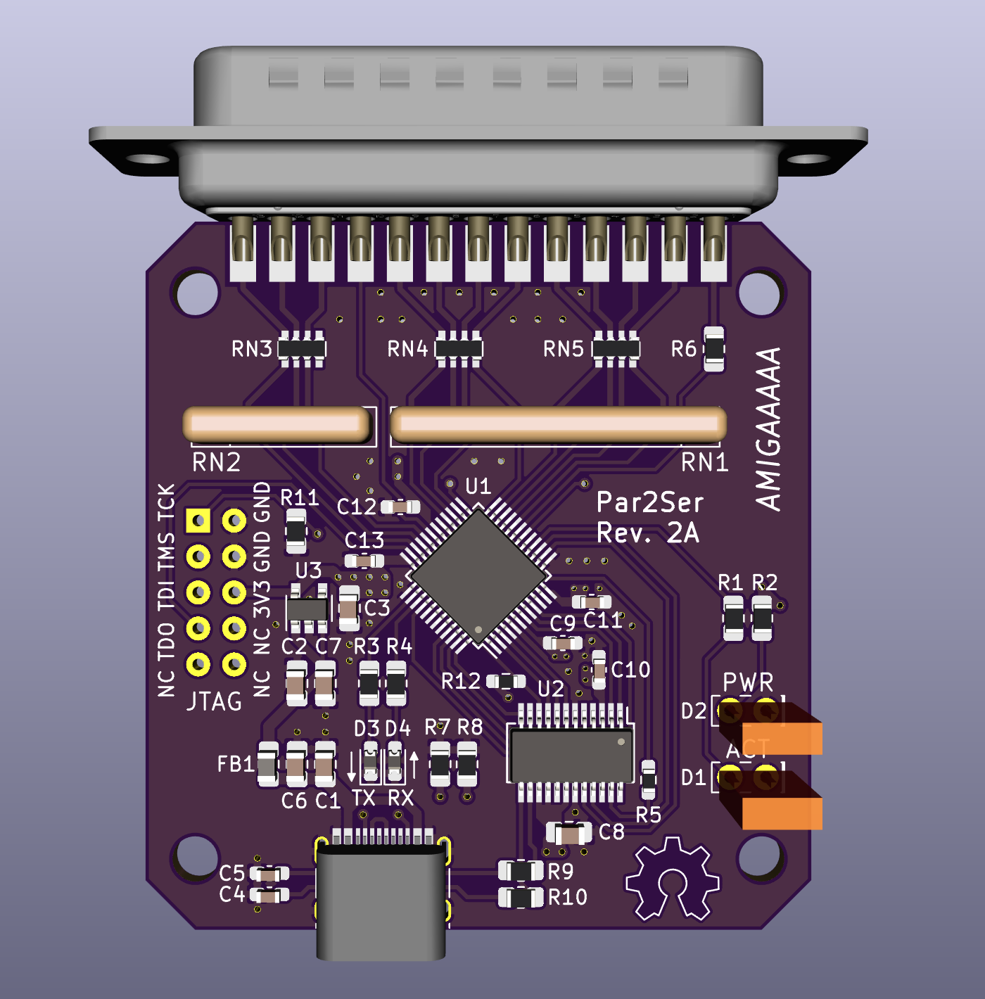
</a>

***

A `serial.device`-compatible Amiga driver that bridges the parallel port to a
USB FIFO (FT240X) via Niklas Ekström's 2E par-to-spi protocol, so unmodified
comms programs (c-kermit, NComm, …) can `set line par2ser.device`.

The hardware side is a small board built around a Lattice **LC4064V-75TN48C**
CPLD that speaks the 2E protocol to the Amiga and presents the bytes to an
**FT240X** USB FIFO. The PC sees a standard USB serial port (VCP).

## Repository layout

- **`amiga/`** — `par2ser.device` driver source (m68k, Bartman gcc).
- **`cpld/`** — Verilog firmware for the Lattice LC4064V CPLD.
  - `rtl/` — design sources (`par2ser_top.v`, `par2ser_fsm.v`).
  - `sim/` — Icarus Verilog smoke testbench.
  - `isplever/` — Lattice ispLEVER Classic 2.1 project files and pin
    constraints (`Par2Ser.lci`).
- **`KiCad/`** — KiCad 5.1 schematic and PCB sources (Rev 2A).
- **`FT_PROG/`** — FT_PROG template (`Par2Ser.xml`) capturing the
  FT240X MTP settings the bridge needs (VCP enabled, CBUS5 → CLK12MHz,
  product description). Open it in FT_PROG and apply to a fresh
  board to skip the manual click-through.
- **`images/`** — board photos and screenshots used in this README.
- **`Par2Ser_rev2a_schematic.pdf`** — exported schematic for quick
  reference without opening KiCad.

## Hardware overview (Rev 2A)

- **Lattice LC4064V-75TN48C** CPLD (48-pin TQFP, 64 macrocells, -75 speed)
- **FTDI FT240X** USB-to-parallel-FIFO (SSOP-24), USB-C connector
- **8-bit bidirectional buffer** between the Amiga DB-25 and the CPLD
- **JTAG header** for programming the CPLD via ispVM System with a
  cheap FT4232H-mini-module-based cable

The driver is built in the style of [SimpleDevice](https://github.com/jbilander/SimpleDevice)
for the Bartman `m68k-amiga-elf` (gcc 15.1) toolchain. The serial machinery
(receive ring buffer, `CMD_READ` satisfied from buffer, `SDCMD_QUERY` count
from a software counter) is ported from Iain Barclay's `8n1.device` 43.5.

It targets **Kickstart 1.3** (and up): the sources include `<ks13_compat.h>`,
which uses `#pragma GCC poison` to turn any accidental call to a KS 2.0+
library function into a compile error, so the driver stays loadable on an
unexpanded A500/A2000.

## Bill of Materials (Rev 2A)

Sourcing notes: most actives and precision passives are from
[Mouser](https://www.mouser.com/), the connectors and decorative
LEDs are inexpensive enough to come from AliExpress sellers (linked
examples below — any equivalent footprint works). Generic 0805/0603
passives can be substituted with any reputable manufacturer's part
matching the value, package, and dielectric/tolerance noted.

| Ref               | Qty | Value / Part         | Description                                    | Package        | Source                                                                                          | Notes                                                       |
|-------------------|-----|----------------------|------------------------------------------------|----------------|-------------------------------------------------------------------------------------------------|-------------------------------------------------------------|
| **U1**            | 1   | LC4064V-75TN48C      | Lattice ispMACH 4000V CPLD                     | 48-TQFP        | [Mouser 842-LC4064V75TN48C](https://www.mouser.com/ProductDetail/842-LC4064V75TN48C)             | 64 macrocells, -75 speed grade                              |
| **U2**            | 1   | FT240XS-R            | FTDI USB-to-parallel FIFO                      | SSOP-24        | [Mouser 895-FT240XS-R](https://www.mouser.com/ProductDetail/895-FT240XS-R)                       | USB 2.0 Full Speed; VCP driver                              |
| **U3**            | 1   | TLV75533PDBVR        | TI 3.3 V LDO regulator, 500 mA                 | SOT-23-5       | [Mouser 595-TLV75533PDBVR](https://www.mouser.com/ProductDetail/595-TLV75533PDBVR)               | Fixed 3.3 V output                                          |
| **J1**            | 1   | DB25 Male            | Right-angle PCB DB-25 (M)                      | Solder cups   | [AliExpress example](https://www.aliexpress.com/item/1005006354086316.html)                      | Amiga parallel port                                         |
| **J2**            | 1   | USB-C 2.0 (TYPE-C-02) | 16-pin USB-C, USB 2.0 only (no SuperSpeed)    | SMD + THM tabs | [AliExpress example](https://www.aliexpress.com/item/1005005371954812.html)                      | Common "TYPE-C-02" footprint                                |
| **J3**            | 1   | 2×5 pin header       | 2.54 mm pitch, 10-pin (2×5)                    | Through-hole   | [AliExpress example](https://www.aliexpress.com/item/1005001493183557.html)                      | Optional — can press-fit ribbon during programming          |
| **FB1**           | 1   | 600 Ω @ 100 MHz       | Ferrite bead                                   | 0805           | [Mouser 875-HZ0805E601R-10](https://www.mouser.com/ProductDetail/875-HZ0805E601R-10)              | USB VBUS filter                                             |
| **D1**            | 1   | Yellow LED           | Activity LED (optional)                        | 2×5×7 mm TH    | [AliExpress example](https://www.aliexpress.com/item/1005006220921860.html)                      | Lit when transaction in progress                            |
| **D2**            | 1   | Green LED            | Power LED (optional)                           | 2×5×7 mm TH    | [AliExpress example](https://www.aliexpress.com/item/1005006220921860.html)                      | 3.3 V rail indicator                                        |
| **D3**            | 1   | Red LED              | TX LED                                         | 0603 SMD       | [AliExpress example](https://www.aliexpress.com/item/1005005975741298.html)                      | Amiga → PC byte flow                                        |
| **D4**            | 1   | Red LED              | RX LED                                         | 0603 SMD       | [AliExpress example](https://www.aliexpress.com/item/1005005975741298.html)                      | PC → Amiga byte flow                                        |
| **RN1**           | 1   | 8×10 kΩ bussed (A09-103JP) | 9-pin SIP resistor network               | SIP-9          | [AliExpress example](https://www.aliexpress.com/item/1005006954621214.html)                      | Amiga D0..D7 pull-ups, one common                           |
| **RN2**           | 1   | 4×10 kΩ bussed (A05-103JP) | 5-pin SIP resistor network               | SIP-5          | [AliExpress example](https://www.aliexpress.com/item/1005006954621214.html)                      | Additional Amiga-side pull-ups                              |
| **RN3, RN4, RN5** | 3   | 4×330 Ω isolated     | 8-pin SMD isolated resistor array              | 1206-8         | [Mouser 652-CAY16-3300F4LF](https://www.mouser.com/ProductDetail/652-CAY16-3300F4LF)              | Series limiters on signal lines                             |
| **R1, R3, R4**    | 3   | 1 kΩ                 | LED current limiter / signal                   | 0805           | [Mouser 652-CR0805FX-1001ELF](https://www.mouser.com/ProductDetail/652-CR0805FX-1001ELF)          |                                                             |
| **R2**            | 1   | 10 kΩ                | Series for D2 power LED (high R = low brightness) | 0805        | [Mouser 652-CR0805FX-1002ELF](https://www.mouser.com/ProductDetail/652-CR0805FX-1002ELF)          | Matches green power-LED forward voltage                     |
| **R5**            | 1   | 33 Ω                 | CLKOUT line damping resistor                   | 0603           | [Mouser 652-CR0603FX-33R0ELF](https://www.mouser.com/ProductDetail/652-CR0603FX-33R0ELF)          | Common practice for clock lines, not per FT240X datasheet  |
| **R6**            | 0   | 330 Ω (**DNP**)      | Series on /STROBE — not populated              | 0805           | [Mouser 652-CR0805FX-3300ELF](https://www.mouser.com/ProductDetail/652-CR0805FX-3300ELF)          | **Do Not Place** — populate only if /STROBE used in fw      |
| **R7, R8**        | 2   | 5.1 kΩ               | USB-C CC1/CC2 pull-downs                       | 0805           | [Mouser 652-CR0805FX-5101ELF](https://www.mouser.com/ProductDetail/652-CR0805FX-5101ELF)          | Identifies device as USB 2.0 (sink)                         |
| **R9, R10**       | 2   | 27 Ω                 | USB D+/D− series                               | 0805           | [Mouser 652-CR0805FX-27R0ELF](https://www.mouser.com/ProductDetail/652-CR0805FX-27R0ELF)          | Per USB 2.0 Full Speed spec                                 |
| **R11**           | 1   | 4.7 kΩ               | Pull-down for TCK (JTAG)                       | 0805           | [Mouser 652-CR0805FX-4701ELF](https://www.mouser.com/ProductDetail/652-CR0805FX-4701ELF)          | Standard JTAG practice                                      |
| **R12**           | 1   | 10 kΩ                | Pull-up for SIWU#                              | 0603           | [Mouser 652-CR0603-JW-103ELF](https://www.mouser.com/ProductDetail/652-CR0603-JW-103ELF)          | Keeps SIWU# deasserted when CPLD pin 44 is high-Z           |
| **C1, C2**        | 2   | 4.7 µF, 10 V, X7R    | VBUS bulk / LDO input                          | 0805           | [Mouser 81-GRM21BR71A475KE1K](https://www.mouser.com/ProductDetail/81-GRM21BR71A475KE1K)          | Murata GRM21 X7R, 10 V                                      |
| **C3**            | 1   | 1 µF, X7R            | LDO output filter                              | 0805           |                                                                                                 | Per TLV75533 datasheet                                      |
| **C4, C5**        | 2   | 47 pF, C0G/NP0       | USB D+/D− noise filter                         | 0603           | [Mouser 791-0603N470G160CT](https://www.mouser.com/ProductDetail/791-0603N470G160CT)              | Tight tolerance important                                   |
| **C6, C7, C8**    | 3   | 0.1 µF, X7R          | Decoupling (0805 spots)                        | 0805           |                                                                                                 |                                                             |
| **C9 – C13**      | 5   | 0.1 µF, X7R          | Decoupling (0603 spots)                        | 0603           |                                                                                                 | One per VCC pin                                             |

**Distinct line items: 27** &nbsp;·&nbsp; **Components to populate: 37** (38 if /STROBE is wired up in a future firmware — see R6)

### Mounting and additional hardware

- The **LC4064V** is JTAG-programmable in-circuit — no socket needed.
- The **JTAG header (J3)** uses the standard Lattice 2×5 pinout —
  check `cpld/README.md` for the exact pinout and the recommended
  FT4232H-Mini-Module-based cable. The header doesn't have to be
  soldered down; you can press-and-hold the 2×5 ribbon cable
  against the pads during programming.

### 3D-printable case

A 3D-printable two-part case is provided in the `3D/` folder. It is
adapted from the former **SDBox-v2** case, slimmed down and made more
proportional — the Rev 2A design no longer has to house a bulky
Arduino Nano v3, so the enclosure is significantly thinner. The DB-25
exits one end and the USB-C port the other, and the top lid has two
holes for the panel LEDs: one for the **Power LED (green)** and one for
the **Activity LED (yellow)**.

| File | Description |
|------|-------------|
| `3D/Par2Ser.scdoc` | SpaceClaim source file for the case |
| `3D/Par2Ser.stp` | STEP export (top + bottom) for use in other CAD tools |
| `3D/Par2Ser_top.stl` | Top lid, ready to slice and print |
| `3D/Par2Ser_bottom.stl` | Bottom shell, ready to slice and print |
| `3D/Par2Ser_text.skp` | SketchUp source for the embossed "Par2Ser" lid text |

<table>
  <tr>
    <td align="center">
      <a href="images/Par2Ser_case_pic3.png">
        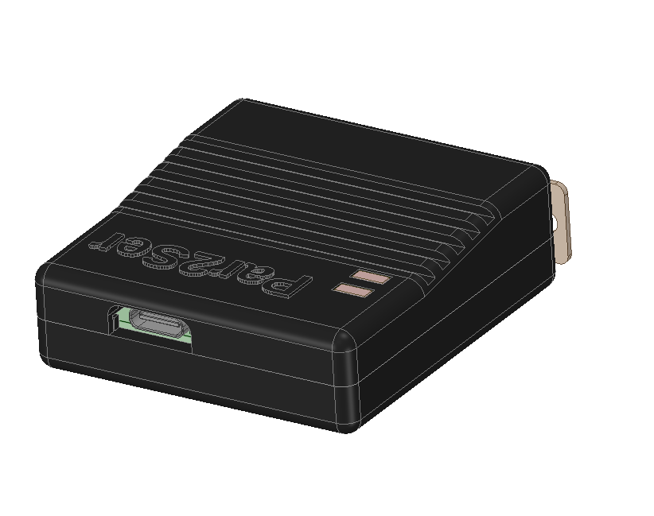
      </a><br />
      <sub>USB-C end, with the two LED holes in the top lid</sub>
    </td>
    <td align="center">
      <a href="images/Par2Ser_case_pic1.png">
        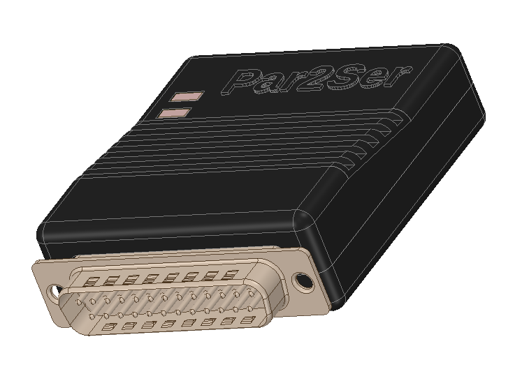
      </a><br />
      <sub>DB-25 end</sub>
    </td>
  </tr>
  <tr>
    <td align="center">
      <a href="images/Par2Ser_case_pic4.png">
        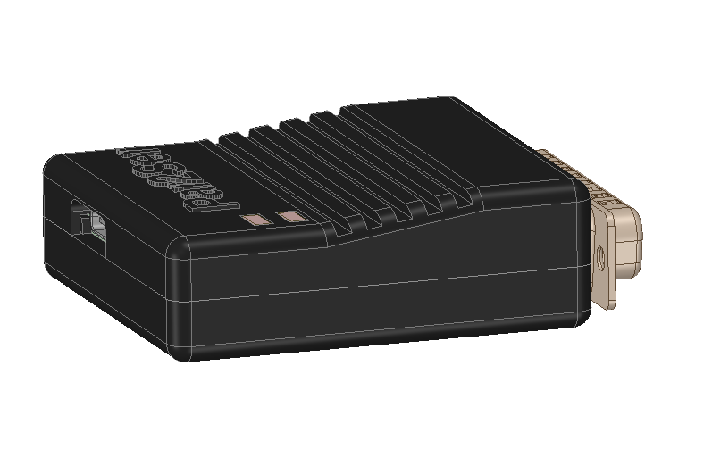
      </a><br />
      <sub>Side profile showing the slimmer enclosure</sub>
    </td>
    <td align="center">
      <a href="images/Par2Ser_case_pic2.png">
        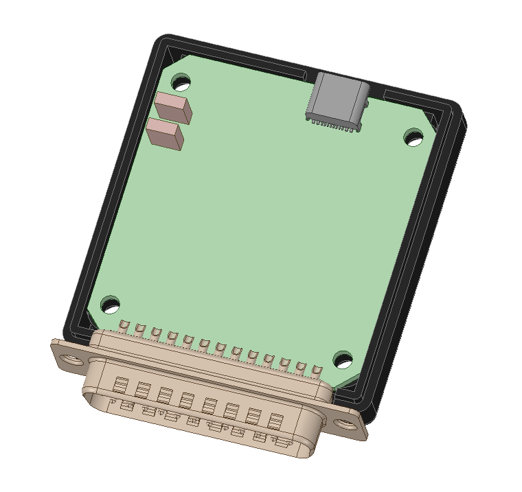
      </a><br />
      <sub>PCB fitted into the bottom shell</sub>
    </td>
  </tr>
</table>

The renders above are from the CAD program. The case was printed on a
Creality Ender-3 Pro in white PLA. The build photos below show the
assembly steps and the finished unit fitted to an Amiga 500.

#### Fitting the panel LEDs

The two indicator LEDs are soldered last. Fit the **PWR (green, Power)**
and **ACT (yellow, Activity)** LEDs into their positions, then check
from the top that each one protrudes ever so slightly through its hole
in the case lid. Once the height looks right, tack down a single leg,
snip the leads flush, and only then solder both joints properly. Doing
it in that order keeps the LEDs sitting at the correct height instead of
being pushed in or standing too proud.

<table>
  <tr>
    <td align="center">
      <a href="images/Par2Ser_soldering_PWR_and_ACT_LEDs.jpg">
        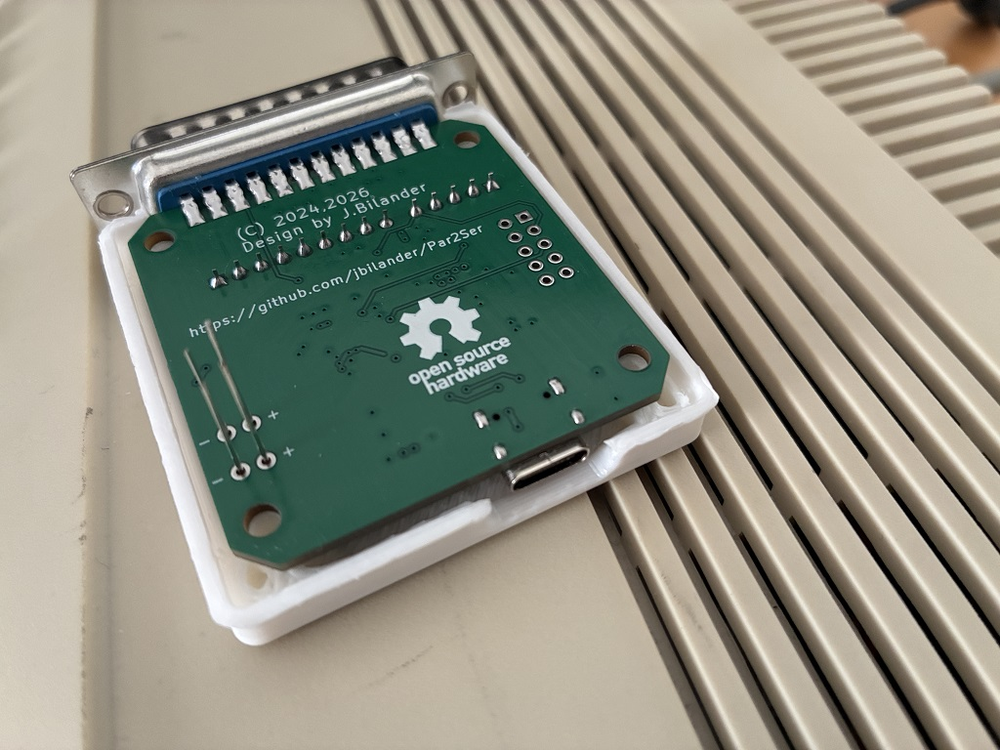
      </a><br />
      <sub>Test-fitting the green PWR and yellow ACT LEDs before tacking them down</sub>
    </td>
    <td align="center">
      <a href="images/Par2Ser_soldering_completed.jpg">
        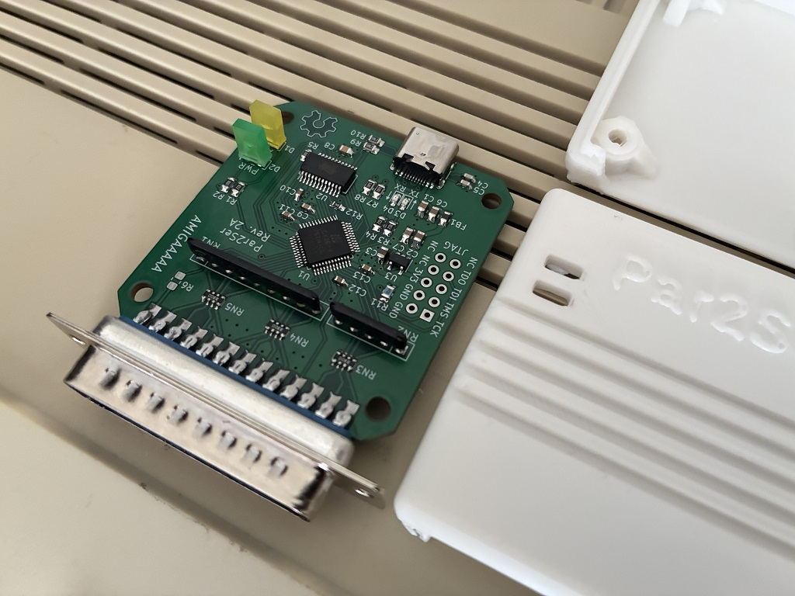
      </a><br />
      <sub>Underside of the finished board seated in the bottom shell</sub>
    </td>
  </tr>
</table>

#### Finished unit

<table>
  <tr>
    <td align="center">
      <a href="images/Par2Ser_installed_in_case.jpg">
        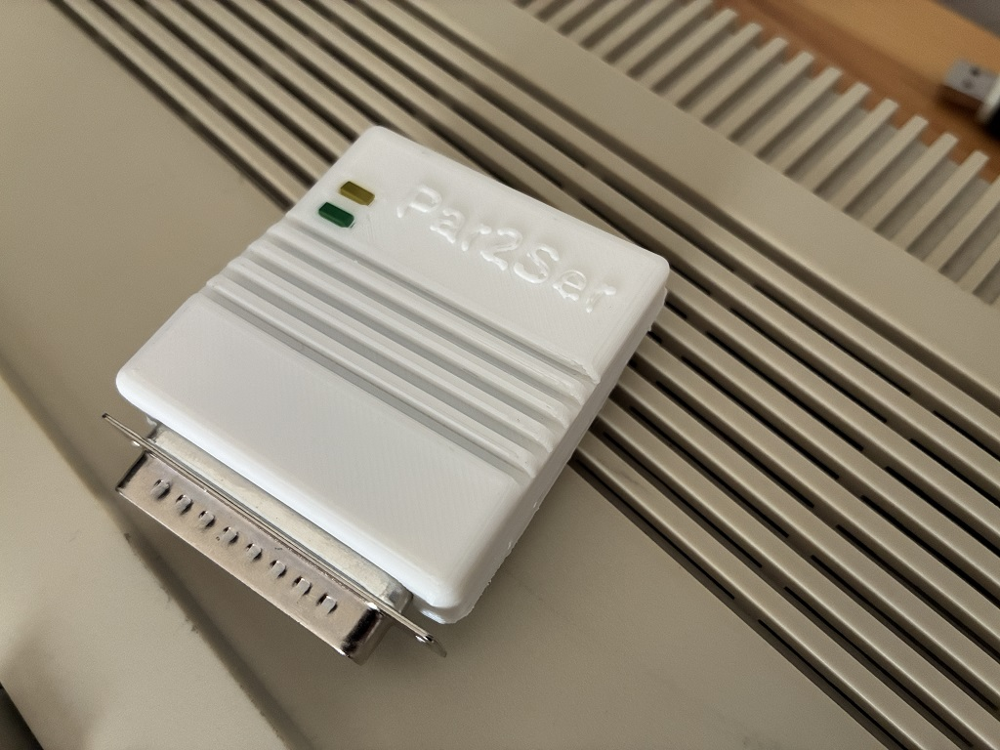
      </a><br />
      <sub>Assembled case closed up, with the PWR/ACT LEDs visible through the lid</sub>
    </td>
    <td align="center">
      <a href="images/Par2Ser_installed_in_A500_and_connected_to_PC.jpg">
        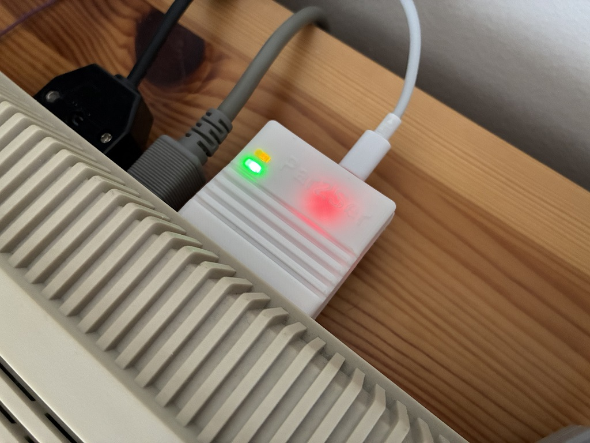
      </a><br />
      <sub>Plugged into the A500 parallel port and connected to a PC over USB-C</sub>
    </td>
  </tr>
</table>

In the powered-on photo the green **PWR** LED is lit, and the red glow
bleeding through the lid is the FT240XS **RX/TX** LEDs shining through
the white PLA — here the blink firmware has the **TX** LED on. This is
something of a happy accident: if you don't want the glow, print the
case in black or another dark material, or simply leave the RX/TX LEDs
unpopulated.

> **Note:** The USB-C cut-out in the current print is slightly too wide.
> It's a cosmetic issue only — the port works fine — and will be tidied
> up shortly so the opening sits more symmetrically around the connector.

## Files (amiga/)

- `par2ser.c` — device skeleton + serial command set + receive ring buffer
- `transport.h` / `transport.c` — byte-pipe to the adapter (**stubbed** for now)
- `debug.c` — `KPrintF` over `RawDoFmt`/`RawPutChar` (verbatim from SimpleDevice)
- `Makefile`

## Build (amiga/)

```sh
cd amiga
make debug      # build-debug/par2ser.device, with KPrintF tracing
make release    # build-release/par2ser.device, stripped
```

Adjust `INCDIRS` for your NDK path as in SimpleDevice.

## Programming the FT240X (one-time, before first use)

The CPLD needs a 12 MHz clock from the FT240X to operate. By default
the FT240X's CBUS5 pin is **not** configured as a clock output — you
have to set its function in the chip's internal MTP (one-time-programmable)
memory using FTDI's **FT_PROG** utility. While you're at it, you should
also tell the chip to advertise itself as a Virtual COM Port (VCP) so
that comms software on the host can open it as a regular serial port,
and you can optionally set a friendly USB product-description string.

These settings are all stored on the FT240X chip itself — they
persist across power cycles and across host machines.

### What you'll need

- FTDI **FT_PROG** (free download from <https://ftdichip.com/utilities/>;
  requires .NET Framework 4.0 or newer, which is included with
  Windows 8.1 and above)
- The Rev 2A board, powered via USB, on a Windows machine (FT_PROG
  is Windows-only; users on Linux/macOS can use a Windows VM, or
  the open-source `ftdi_eeprom` from libftdi as an alternative —
  see note at the end of this section)

### Install FT_PROG

Download FT_PROG from <https://ftdichip.com/utilities/> (current version
at time of writing: 3.12.75.692). Extract the ZIP, run the installer,
click through to **Finish**:

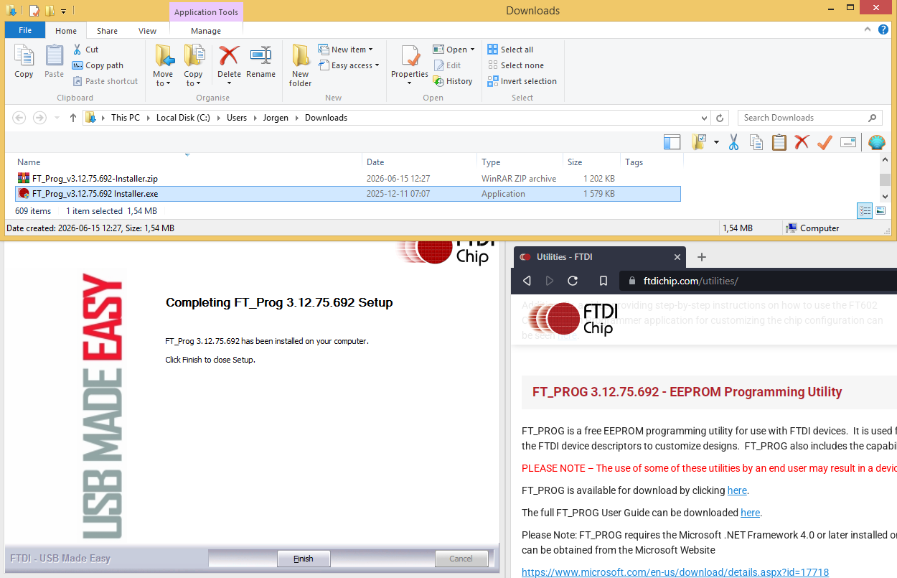

### Fast path: apply the supplied template

The `FT_PROG/Par2Ser.xml` file in this repo is a saved FT_PROG template
with all the settings the Par2Ser bridge needs (VCP enabled, CBUS5 →
CLK12MHz, CBUS6 → Keep_Awake#, Product Description → `Par2Ser USB Serial`).
The fast path is:

1. Plug the Rev 2A board into a Windows PC via USB-C. Windows will
   detect the FT240X and bind FTDI's bus-level driver, presenting
   the device as **"USB Serial Converter"** under
   *Universal Serial Bus controllers* in Device Manager.
2. Launch FT_PROG and **FILE → Open** the `FT_PROG/Par2Ser.xml`
   template — this loads the desired settings into FT_PROG's editor.
3. **DEVICES → Scan and Parse** (<kbd>Ctrl+P</kbd>) to bring the
   live chip's current settings under the same editor.
4. **DEVICES → Program** to apply the template values to the chip
   — confirm the success dialog appears.
5. Unplug and replug the board.

If you'd rather understand or customize each setting, walk through
the manual steps below instead.

### Manual walkthrough (step-by-step)

1. Plug the Rev 2A board into a Windows PC via USB-C. Windows will
   detect the FT240X and bind FTDI's bus-level driver, presenting
   the device as **"USB Serial Converter"** under
   *Universal Serial Bus controllers* in Device Manager. (Whether
   a COM port appears at this stage depends on the host's driver
   state — see "Driver behavior across operating systems" below.)

2. Launch FT_PROG. Click **DEVICES → Scan and Parse** (or
   <kbd>Ctrl+P</kbd>). The device tree on the left should populate
   with the FT240X, and the lower pane shows the EEPROM contents
   dump:

   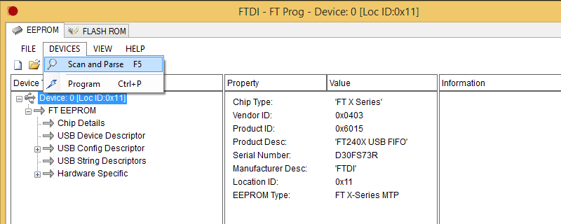

3. Enable the **VCP driver mode**: in the device tree, expand
   **Hardware Specific → Port A → Driver** and select the
   **Virtual COM Port** radio button (it may be on "D2XX Direct"
   by default):

   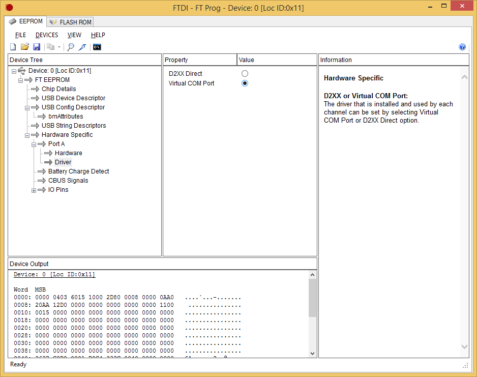

4. Configure the **CBUS5 clock output**: navigate to
   **Hardware Specific → CBUS Signals** and set the **C5** drop-down
   to **`CLK12MHz`**. The C6 drop-down can be left at its default
   (`Keep_Awake#`) — CBUS6 is wired to the CPLD but not used by the
   current firmware:

   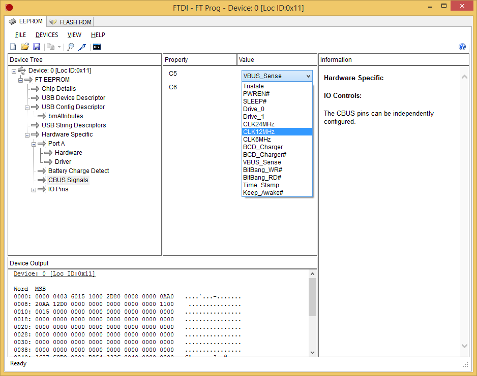

5. (Optional) Update the **USB String Descriptors** to identify the
   device as a Par2Ser. Setting the *Product Description* to
   `Par2Ser USB Serial` makes it easier to find when several FTDI
   devices are plugged into the same host. The factory-assigned
   *Serial Number* is unique per chip and stable — useful when
   binding driver settings or `udev` rules per device:

   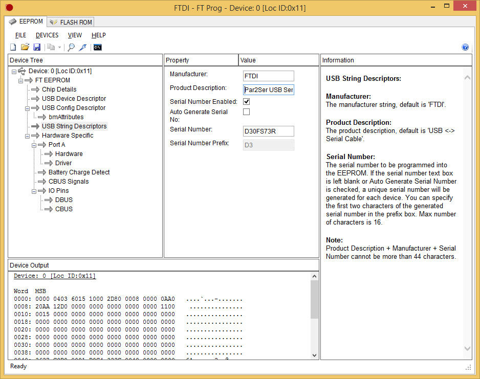

6. Click **DEVICES → Program** (the lightning-bolt icon). The
   *Program Devices* dialog shows the chip type, VID/PID, and the
   strings about to be written to MTP. Confirm the values look right
   and click **Program**:

   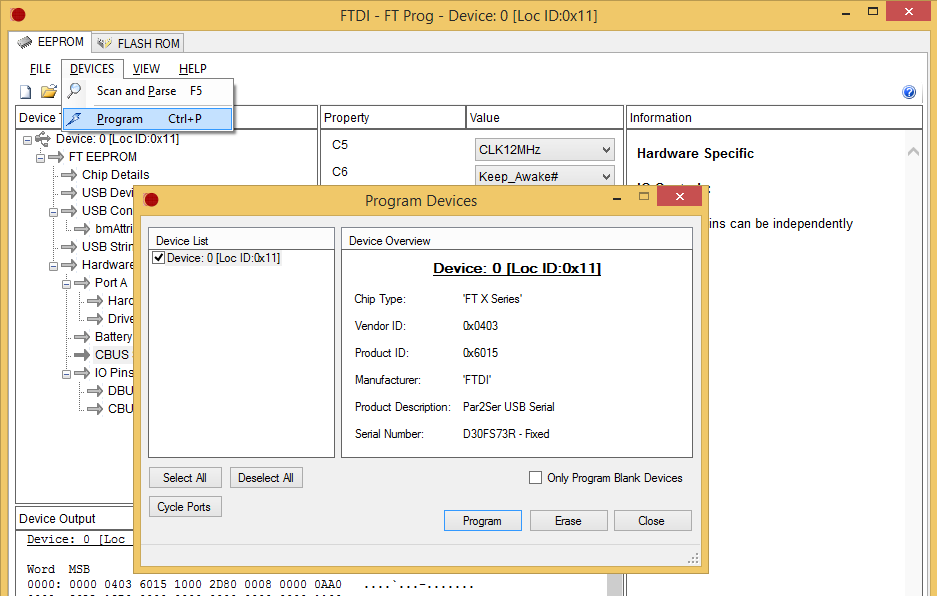

   You should see **"Programming Successful"** at the bottom of the
   dialog when the write completes:

   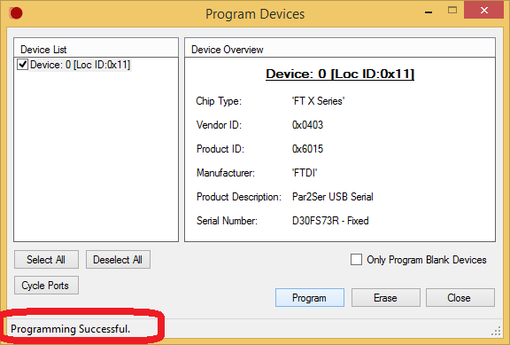

7. Unplug and replug the board. Windows will re-enumerate the device.

### Verifying the configuration

After the FT_PROG round-trip, you can confirm the chip is configured
correctly with one or both of:

**A. Oscilloscope check of the 12 MHz clock.** With the board powered
via USB, probe the trace at R5 (the damping resistor on the CPLD's
clock input). You should see a clean ~12 MHz square wave near rail-to-rail
on a 3.3 V LVTTL swing:

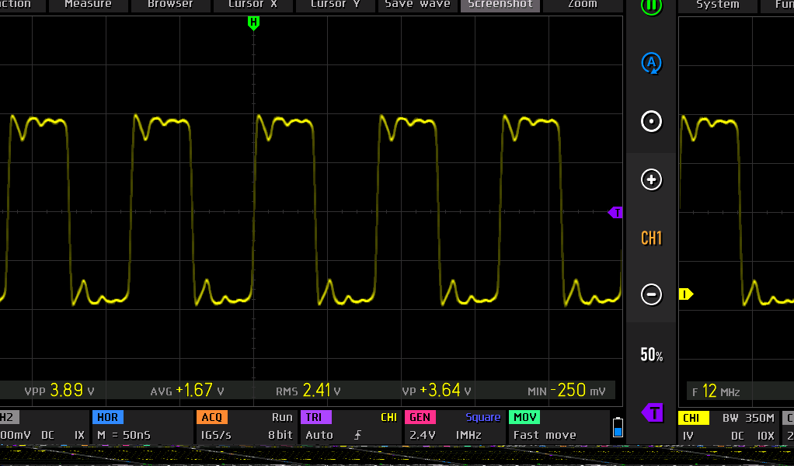

The small overshoot/ringing on the edges is the scope probe's ground-lead
inductance, not a problem with the signal — using a probe ground spring
close to the test point cleans it up. The signal is well within LVTTL
input tolerances at the CPLD's pin 43.

**B. COM-port enumeration check on the host.** The board should appear
as a serial port. The device name varies by OS — see below.

### Driver behavior across operating systems

The FT_PROG settings live on the chip; *whether* a given host then
makes them visible as a normal COM/tty port depends on what FTDI driver
support that host has. Tested behavior so far:

| Host                    | Result                                  | Driver intervention needed |
|-------------------------|-----------------------------------------|----------------------------|
| **macOS 10.15 Catalina** | `/dev/cu.usbserial-XXXXXXXX` on plug-in | None — Apple's built-in `AppleUSBFTDI` driver handles it |
| **Linux** (Pop!\_OS, Ubuntu, similar) | `/dev/ttyUSB0` on plug-in     | None — the in-kernel `ftdi_sio` module binds automatically |
| **Windows 10/11**       | `USB Serial Port (COMn)` under *Ports (COM & LPT)* | Typically none — Windows Update pushes the FTDI CDM (Combined Driver Model) package automatically |
| **Windows 8.1**         | Depends on the machine's history (see below) | One-time CDM install on a fresh host |

The Windows 8.1 case is the only one with a footgun, and it's
machine-specific rather than OS-specific. On Windows 8.1, the **CDM
(Combined Driver Model)** package — which contains both the bus-level
driver (`USB Serial Converter`) *and* the VCP layer that creates the
COM port — is not bundled with the OS. It can be installed via
Windows Update, but isn't always pushed automatically.

In our testing on two Windows 8.1 SP2 machines:

- **Machine A**: had previously hosted other FTDI devices. When the
  Par2Ser board was first plugged in, Windows auto-installed both
  the USB Serial Converter and the VCP layer, and a COM port
  (`COM4`) appeared under *Ports (COM & LPT)* immediately. The
  "Installing Par2Ser USB Serial" progress dialog appeared
  automatically:

  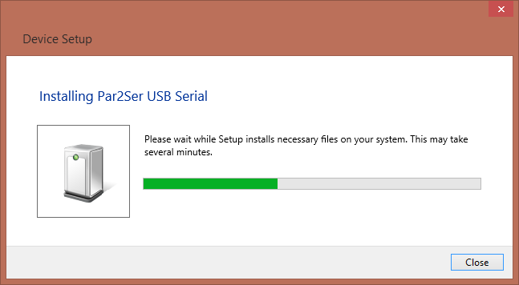

  After the install, Device Manager's Events tab on the resulting
  `USB Serial Port (COMn)` entry shows the FTDI VCP driver service
  `FTSER2K` being registered and `ftdiport.inf` driving the COM-port
  instance — the proof that the VCP layer attached on top of the
  bus-level driver:

  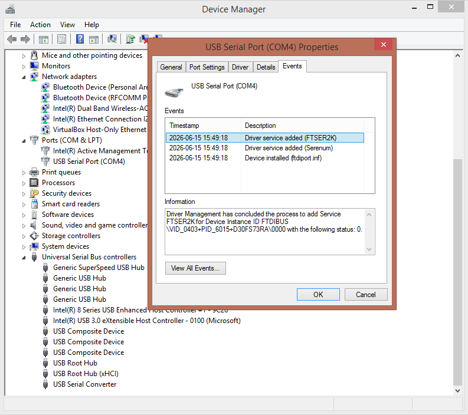

- **Machine B**: had not previously had an FTDI device on it.
  Plugging in the Par2Ser board only created the *USB Serial
  Converter* entry under *Universal Serial Bus controllers*; no COM
  port appeared. **The fix on this machine turned out to be very
  simple**: right-click *USB Serial Converter* in Device Manager,
  choose **Uninstall**, in the dialog that appears **leave the
  "Delete the driver software for this device" checkbox unchecked**,
  click OK, then unplug and replug the board. Windows re-enumerated
  the device, picked up the VCP driver this time, and `COM10`
  appeared under *Ports (COM & LPT)*. Total time: about 30 seconds.

  This "uninstall (keep files) then replug" trick works on a Win8.1
  machine that has the FTDI VCP driver files present on disk but
  somehow bound only the bus-level driver on the first plug-in.
  The driver files are kept; only the device-to-driver binding is
  cleared, so the next enumeration can re-pick the correct (full)
  driver stack.

**If you're on Windows 8.1 (or earlier) and no COM port appears**,
try the uninstall-without-deleting-files trick first — it's quick
and reversible. If that doesn't work (the VCP driver files truly
aren't present on the machine), install FTDI's CDM driver package
from <https://ftdichip.com/drivers/vcp-drivers/> — download the
*setup executable*, unplug the board, run the installer, replug.
After that the COM port will appear on every subsequent plug-in.
The MTP setting in the chip stays correct throughout; only the
host needs the right driver layer bound.

On Linux and macOS, no equivalent step is needed — the driver shipped
with the OS supports the FT240X out of the box.

### Linux/macOS alternative for the MTP programming (libftdi)

On non-Windows systems, the MTP programming (CBUS5 → CLK12MHz, VCP
enable, etc.) can be done with `ftdi_eeprom` from the `libftdi`
package — but it has not been tested by the author of this repo.
You'd need a small config file pointing at the FT240X (matched by
VID/PID `0403:6015`) and setting `cbus5=CLK12`. See the libftdi
documentation for the exact syntax.

The simplest path for now is to do the one-time FT_PROG step on any
available Windows machine. Once the FT240X's MTP is programmed, the
chip behaves identically on any host.

## Programming the CPLD via JTAG

The LC4064V is programmed in-circuit via the 2x5 JTAG header (J3)
using **ispVM System** (the legacy Lattice programming tool, bundled
with the free ispLEVER Classic install). For the JTAG cable, an
inexpensive **FT4232H Mini Module** works well as a generic FTDI
cable that ispVM recognizes as `USB2 / FTUSB-0` without needing any
EEPROM modification.

### Wiring (FT4232H Mini Module ↔ Par2Ser J3)

The FT4232H's channel A MPSSE pins map to JTAG signals as follows:

| FT4232H Mini Module | JTAG signal | Par2Ser J3 pin |
|---------------------|-------------|----------------|
| **AD0** (ADBUS0)    | TCK         | pin 1 (TCK)    |
| **AD1** (ADBUS1)    | TDI         | pin 5 (TDI)    |
| **AD2** (ADBUS2)    | TDO         | pin 7 (TDO)    |
| **AD3** (ADBUS3)    | TMS         | pin 3 (TMS)    |
| any GND on module   | GND         | pin 2 or 4     |

Do NOT connect the FT4232H's 3.3 V or 5 V output to J3 — the
Par2Ser self-powers from USB-C and J3 pin 6 (3V3) is an output
from the board, not a power input.

The J3 header doesn't have to be soldered down — you can press
the 2x5 ribbon connector (or individual jumper wires) against the
through-hole pads with gentle hand-held force during programming.

*Note: RN2, the 10 kΩ pull-up network for TMS, can be left
unpopulated and JTAG will still work. The FT4232H actively drives
TMS during programming, and the LC4064V has a weak internal
pull-up on TMS per IEEE 1149.1. RN2 should still be populated
before final use for noise immunity when the JTAG cable is
disconnected.*

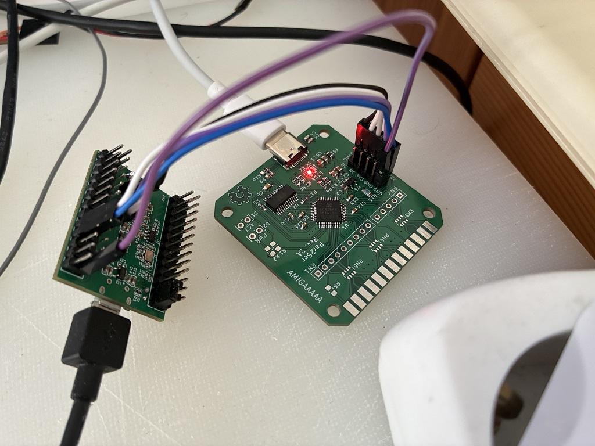

### Driver setup (Windows)

For ispVM to talk to the JTAG cable, **channel A (Interface 0) of
the FT4232H must be bound to FTDI's D2XX driver** (not
libusb-win32, WinUSB, or libusbK). The other three interfaces
(B/C/D) are not used by ispVM and can stay bound to whatever
driver they had previously.

After plugging in the Mini Module, open Device Manager and locate
the four "Quad RS232-HS" entries (Interface 0/1/2/3). If
Interface 0 is bound to the wrong driver — for example, listed
under *libusb-win32 device* (a typical leftover from a previous
OpenOCD session) rather than under *Universal Serial Bus
controllers* — rebind it:

1. Right-click **Quad RS232-HS (Interface 0)** → **Update Driver
   Software** → **Browse my computer for driver software** →
   **Let me pick from a list of devices on my computer**.
2. Select **USB Serial Converter A** (FTDI's D2XX driver, version
   2.12.36.4 or newer).
3. Click Next. Windows will rebind Interface 0 to the D2XX driver
   without affecting Interfaces 1–3.
4. **Restart ispLEVER/ispVM** — without this, the running ispVM
   process still has the old driver state cached and will not see
   the cable.

After the rebind, Device Manager should show one entry as
`USB Serial Converter A` under *Universal Serial Bus controllers*
(Interface 0, the one ispVM will use), and the other three
interfaces (1/2/3) wherever they were before — that's fine, they're
not used for JTAG.

### Programming procedure

1. **Power the Par2Ser from a USB charger**, not from the same PC
   running ispVM. This is important: if the Par2Ser is plugged into
   the same Windows host that is running ispVM, both FTDI devices
   (the Par2Ser's FT240X and the FT4232H Mini Module) appear as
   "USB Serial Converter" entries, and ispVM can grab the wrong one.
   Powering Par2Ser from a separate USB charger keeps it powered
   while leaving only the FT4232H Mini Module visible to ispVM.

2. **Connect the JTAG cable** per the wiring table above, with the
   FT4232H Mini Module plugged into the Windows PC.

3. **Launch ispVM System** (Start Menu → Lattice Semiconductor →
   ispVM System).

4. **Scan Board** (toolbar button) — should detect the LC4064V and
   show it as `LC4064V(B)-32IO` in the chain. (The `(B)-32IO` is
   ispVM's internal name for the 64-macrocell, 32-IO variant — your
   physical chip is the TQFP48 package of that die.)

5. **Double-click the device row** in the chain → set **Data File**
   to the `.jed` file generated by the ispLEVER fitter → set
   **Operation** to *Erase, Program, Verify*.

6. **(Important) Slow down TCK for flywire JTAG.** Open
   **Project → Project Settings → Advanced** and set
   **TCK Low Pulse Width Delay** to **3** or higher. The default
   15 MHz TCK is too fast for the typical flywire connection from
   the FT4232H to J3 — the verify step will fail with all-zeros
   readback on TDO. Stretching the TCK low-pulse by 3× makes
   programming reliable. Note that this setting is **per-project
   in ispVM**, so it has to be set again when switching projects.

7. **Click GO** (green arrow). Programming should complete in 3–10
   seconds with "Operation: Successful" and a green PASS in the
   Status column.

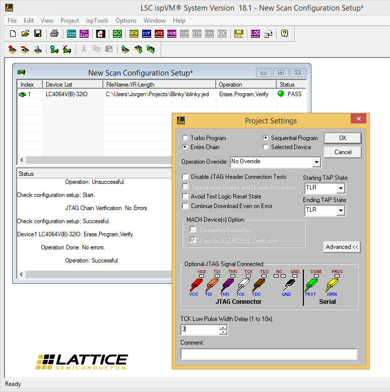

If the TCK Low Pulse Width Delay setting is left at the default
(1) and Debug mode is off, you'll see a `Failed in Function
VERIFY_USERCODE` error in the log, with received TDO reading all
zeros where the expected pattern was the programmed bitstream.
That's the signature of marginal TCK timing on flywire JTAG;
increasing the TCK Low Pulse Width Delay is the fix. (Enabling
Debug mode also happens to make programming work — the per-
transaction logging on the PC side adds enough pacing between
JTAG operations to mask the signal-integrity issue — but that's
an incidental workaround. The proper fix is the TCK delay
setting.)

## Milestone 1 — does kermit accept it? (no hardware needed) ✅

This milestone is **done**. It validates the driver in WinUAE without
any hardware:

1. `make debug` in `amiga/`, copy `build-debug/par2ser.device` to `DEVS:`
   in WinUAE.
2. Open a serial debug console (the same `RawPutChar` path SimpleDevice
   uses).
3. In kermit: `set line par2ser.device`. The trace shows `do_open()`,
   then the commands kermit issues (`SDCMD_SETPARAMS`, `SDCMD_QUERY`, …)
   with their parameters and the status word we return.

In this milestone `transport_write()` discards bytes (reports them sent)
and no RX data ever arrives, so a `CMD_READ` will stay pending — expected
with no hardware. The goal is purely to confirm acceptance and observe
the negotiation, especially the carrier check.

## Carrier / `/CD` handling

kermit checks carrier-detect before it will use the line. We have no real
CIA serial lines on the parallel port, so `SDCMD_QUERY` **synthesizes**
the status word. `serial.device` returns the raw (active-low) CIA-B
control lines, i.e. `0` = signal asserted, so the default
`ST_CARRIER_PRESENT = 0` reports CD/CTS/DSR all asserted.

The full word is `KPrintF`'d in `sdcmd_Query`, so if kermit reports
**NO CARRIER**, flip the polarity in `par2ser.c`:
```c
#define ST_CARRIER_PRESENT  ST_CD   /* try this if 0 doesn't satisfy kermit */
```
and compare the logged status against what kermit expects.

## Milestone 2 — real adapter 🚧

### Transmit — working on hardware ✅

The Amiga → PC direction is verified on a real Rev 2A board: typing in
c-kermit (`cki196`) after `set line par2ser.device` / `connect` produces the
characters in a PC terminal on the FT240X's USB serial port, with the driver's
`KPrintF` trace confirming each `CMD_WRITE`.

Bring-up steps:

1. Build the CPLD firmware in ispLEVER Classic 2.1 — see `cpld/README.md`
   for details. The result is a `par2ser.jed` file.
2. Program the FT240X's CBUS5 to CLK12MHz output (see above).
3. Program the CPLD via ispVM System using a JTAG cable.
4. Build the driver with `make debug` in `amiga/` (the `Makefile` has
   `-DPAR2SER_HW` and the adapter objects enabled), copy
   `build-debug/par2ser.device` to `DEVS:`.

The low-level transport lives in `amiga/low-lib/` (`adapter.c`, `adapter.h`,
`adapter_low.s`). It is derived from Niklas Ekström's parallel-adapter
transport but renamed and reworked for Par2Ser: it is a byte-pipe, not SPI,
so the chip-select / card-present / speed-switch machinery was removed, the
fast-path assembly was ported from vasm to GNU-as syntax for the
`m68k-amiga-elf` toolchain, and the SD-card init was replaced with a plain
parallel-port grab. The WRITE1/READ1 command encoding and the SELECT/POUT/BUSY
handshake are unchanged and are decoded bit-for-bit by the CPLD FSM.

One hardware bug surfaced during TX bring-up and is fixed in the current RTL:
the FT240X write strobe was firing one clock before the CPLD drove the data
bus, so the chip latched a floating bus and bytes arrived as garbage. Driving
the data across the WR pulse (setup + hold around the falling edge) fixed it;
see `cpld/rtl/par2ser_fsm.v`.

### Receive — next 🚧

RX is **not working yet** and is gated off in the driver
(`PAR2SER_RX_ENABLED` in `transport.c`, default 0), so opening the device
installs no receive interrupt. The intended model, once enabled:
`-DPAR2SER_HW` compiles in a CIA-A FLAG receive interrupt server
(`INTB_PORTS`); the CPLD pulses ACK/FLAG when the FT240X RX FIFO is non-empty,
the server drains it into the ring buffer and completes pending reads — the
event-driven model the OS expects, with clients `Wait()`ing on their reply
ports. Before enabling it, the doorbell bit and its polarity need confirming
against the Rev 2A schematic (an early attempt with an unverified doorbell
stormed the ports interrupt and wedged the machine at device-open).

## Credits

- **Niklas Ekström** — the 2E par-to-spi protocol and the SDBox
  adapter that this project is derived from. See his
  [amiga-par-to-spi-adapter](https://github.com/niklasekstrom/amiga-par-to-spi-adapter).
- **Iain Barclay** — `8n1.device` 43.5, the serial machinery template.
- **Bartman** — the `m68k-amiga-elf` toolchain.

## License

Licensed under [Creative Commons Attribution-ShareAlike 4.0 International](https://creativecommons.org/licenses/by-sa/4.0/)
(CC-BY-SA 4.0). You're free to use, modify, and redistribute this work
(including commercially), provided you give appropriate credit and
distribute derivative works under the same license.
